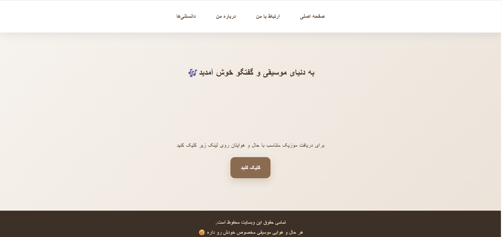
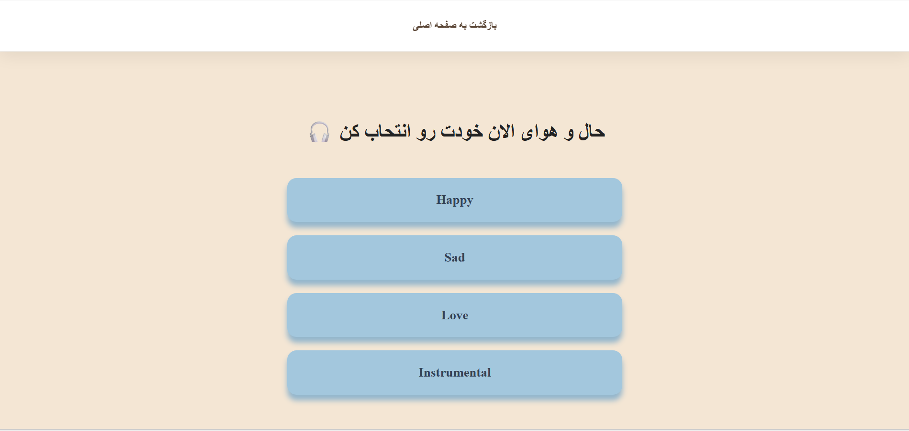
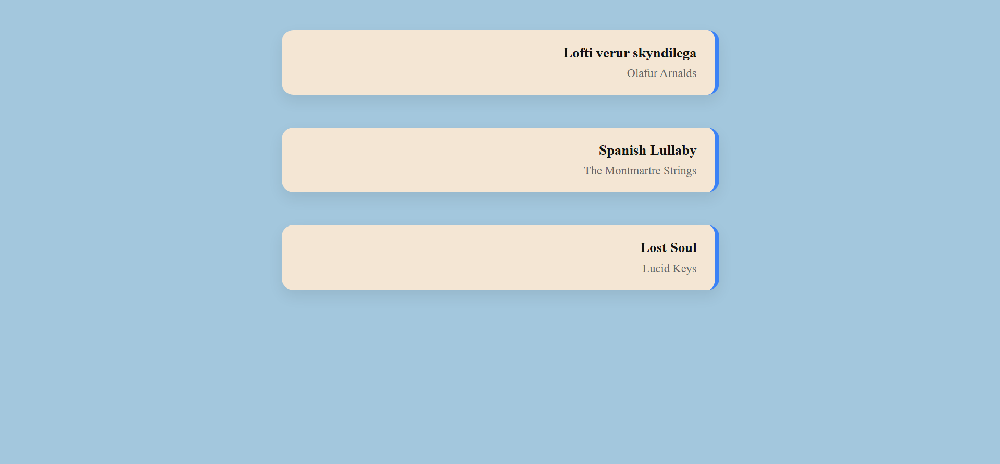

# Music Mood Recommender

A web application that recommends songs based on the user's selected mood.

## 📌 About the Project

Music Mood Recommender is a web application developed with PHP and CodeIgniter 3.

The user can select a mood such as Happy, Sad, Love, or Instrumental and receive a list of songs associated with that mood.

The application also includes a contact form for submitting user messages, which are stored in the MySQL database.

## ✨ Features

- Mood-based song recommendation
- Song data retrieval from MySQL database
- Contact form with message storage
- Music facts section
- MVC architecture
- Database-driven content

## 🛠️ Technologies

- PHP
- CodeIgniter 3
- MySQL
- HTML
- CSS
- MVC

## 🗄️ Database

The application uses MySQL and includes separate tables for:

- Songs
- User messages

The database.sql file is provided to create and populate the database.

## 📁 Project Structure

- application/ → Controllers, Models, Views and application configuration
- assets/ → CSS and other frontend assets
- system/ → CodeIgniter framework files
- database.sql → Database structure and sample data
- index.php → Application entry point

## 📸 Screenshots

### Home Page

### Mood Selection

### Recommended Songs

## 🚀 How to Run

1. Install XAMPP.
2. Copy the project folder into the htdocs directory.
3. Create a MySQL database named music_blog.
4. Import the database.sql file into the database.
5. Check the database configuration in:
   
   application/config/database.php

6. Start Apache and MySQL from XAMPP.
7. Open the project in your browser:

   http://localhost/Music-Mood-Recommender/
